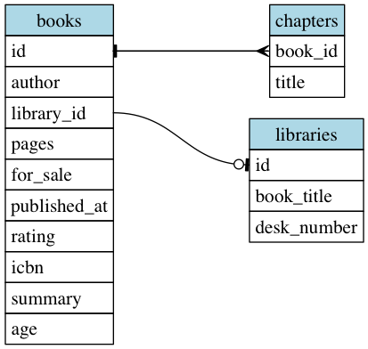

# Eatr

Configuration-based XML and CSV document parsing and transformation library.
Define structs in YAML configuration files and parse documents to create and
populate the structs.

## Table of Contents

* [Installation](#installation)
* [Parsing Documents](#parsing-documents)
  * [Schema Fields Reference](#schema-fields-reference)
    * [Common Header Attributes](#common-header-attributes)
    * [Fields for `Eatr::Csv::Document` schemas](#fields-for-eatrcsvdocument-schemas)
    * [Fields for `Eatr::Xml::Document` schemas](#fields-for-eatrxmldocument-schemas)
* [Transformation Pipeline](#transformation-pipeline)
* [Helpful Tools](#helpful-tools)
  * [`Eatr::Xml::SchemaGenerator`](#eatrxmlschemagenerator)
  * [`Eatr::Sql::TableGenerator`](#eatrsqltablegenerator)
  * [`Eatr::DotGenerator`](#eatrdotgenerator)

## Installation

Add this line to your application's Gemfile:

```ruby
gem 'eatr'
```

And then execute:

    $ bundle

Or install it yourself as:

    $ gem install eatr

## Parsing Documents

The library supports creating a collection of struct objects of arbirary
cardinality.  For example, if you're interested in capturing all the chapters
from an XML representation of a book, but also want to capture higher-level
keys such as the author:

```xml
<book>
  <author>
    <firstName>greggroth</firstName>
  </author>
  <publishedAt>2016-11-12T8:00:00Z</publishedAt>
  <rating>8.9</rating>
  <pages>120</pages>
  <chapters>
    <chapter>
      <title>Ch 1</title>
    </chapter>
    <chapter>
      <title>Ch 2</title>
    </chapter>
  </chapters>
</book>
```

You can use a schema definition like:

```yaml
name: chapters
fields:
  - name: author
    xpath: //author/firstName
    type: string
  - node: chapters
    xpath: //chapters/chapter
    children:
    - name: title
      xpath: ./title
      type: string
```

Here is an example from the test suite of using this XML and schema defintion:

```ruby
> chapters = Eatr::Xml::Document.new('./spec/fixtures/schema/chapters.yaml').parse('./spec/fixtures/xml/book.xml')
=> [#<struct Struct::Chapters author="greggroth", title="Ch 1">,
 #<struct Struct::Chapters author="greggroth", title="Ch 2">]
```

### Schema Fields Reference

#### Common Header Attributes

- `name`
  - Name of the document this schema represents
- `table_name`
  - optional -- defaults to `name`
  - Name of the table in the `CREATE TABLE` statement generated by `Eatr::Sql::TableGenerator`
- `remove_namespaces`
  - optional -- defaults to `false`
  - only apply to XML documents and configures Whether XML namespaces ought to
    be removed before applying XPaths.

`input_field` attributes:

- `name`
  - required
  - Name of the field to be used as the `attr_accessor` in the destination struct.
- `type`
  - optional -- defaults to `string`
  - Can be
    - `boolean`
    - `float`
    - `integer`
    - `string`
    - `timestamp`
- `required`
  - optional -- defaults to `true`
  - If a node cannot be found at the given `xpath`, an `Eatr::NodeNotFound` error is raised.
- `value`
  - optional -- superceeds `xpath` or `csv_header` values
  - If set, this value will be used as the attribute's value
- `strptime`
  - optional -- only applicable if `type` is `timestamp`
  - Format string used to parse the string into a `DateTime` object
- `max_length`
  - optional -- only applicable if `type` is `string`
  - Truncate the string after `max_length` characters
- `length`
  - optional -- only applicable if `type` is `string`
  - Truncate the string after `length` characters

#### Fields for `Eatr::Csv::Document` schemas

- `csv_header`
  - required
  - Name of header the field is expected to be under

#### Fields for `Eatr::Xml::Document` schemas

- `xpath`
  - required
  - Path to the object in the XML document that should be used to populate this field

Node field attributes:

- `node`
  - optional
  - Name to describe this collection of nodes
- `xpath`
  - required
  - Indicates the collection of children documents to be passed to the `chilren` field definitions
- `children`:
  - required
  - Collection of normal field definitions, except their `xpath` is relative to the child document defined per the `xpath` of the parent node.

## Transformation Pipeline

The transformation options provided are lightweight, but very flexible.  A
class `Eatr::Pipeline` is used to execute a set of transformations, which are
simply any object that can be initialized with a hash and responds to `#call`
with a collection of structs.

For example, if you wanted to add a date ID field generated from a timestamp, the schema file should add a `transformations` key:

```yaml
transformations:
  - class: Eatr::Transformation::AddDateId
    args:
      source: published_at
      destination: published_at_date_id
```

The `transformations` key should point to an array of objects with at least a `class` key.  The `class` is the transformer's class name and can be anything that can be looked up using `Object.const_get`.  The `args` key is optional and is passed to `initialize`.

Following is an example of loading a schema file, creating an array of `Book`
struct objects, and applying the transformation defined in the schema.

```ruby
> document = Eatr::Xml::Document.new('./spec/fixtures/schema/book.yaml')
> books = document.parse('./spec/fixtures/xml/book.xml')
=> [#<struct Struct::Book
  id=1,
  author="greggroth",
  library_id=nil,
  pages=120,
  for_sale=false,
  published_at=#<DateTime: 2016-11-12T08:00:00+00:00 ((2457705j,28800s,0n),+0s,2299161j)>,
  published_at_date_id=nil,
  rating=8.9,
  icbn=nil,
  summary="In this lovely ",
  age=12>]
> document.schema.transformation_pipeline.call(books)
=> [#<struct Struct::Book
  id=1,
  author="greggroth",
  library_id=nil,
  pages=120,
  for_sale=false,
  published_at=#<DateTime: 2016-11-12T08:00:00+00:00 ((2457705j,28800s,0n),+0s,2299161j)>,
  published_at_date_id=20161112,
  rating=8.9,
  icbn=nil,
  summary="In this lovely ",
  age=12>]
```

This library only provides the `AddDateId` transformer, however you can create
your own transformation classes.  See the source for `AddDateId` for reference
on how a transformer can be set up.

## Helpful Tools

Included are a few two helper classes:
  - [`Eatr::Xml::SchemaGenerator`](#eatrxmlschemagenerator) creates a rough schema file from a sample XML file.
  - [`Eatr::Sql::TableGenerator`](#eatrsqltablegenerator) creates a SQL `CREATE TABLE` statement from a schema file.
  - [`Eatr::DotGenerator`](#eatrdotgenerator) creates a Graphviz DOT file for visualizing schema relationships (experimental).

### `Eatr::Xml::SchemaGenerator`

Given a sample XML file, this class can be used to generate a schema definition.  For example, from [the spec](spec/xml/schema_generator_spec.rb) you can see that given the XML:

```xml
<book>
  <id>1</id>
  <author>
    <firstName>greggroth</firstName>
    <lastName>roth</lastName>
  </author>
  <publisher>
    <name>BBC</name>
  </publisher>
  <publishedAt>2016-11-12T8:00:00Z</publishedAt>
  <forSale>no</forSale>
  <rating>8.9</rating>
  <pages>120</pages>
  <summary>In this lovely tale, an intrepid warrior ventures out to save a princess.</summary>
  <chapters>
    <chapter>
      <title>Ch 1</title>
    </chapter>
    <chapter>
      <title>Ch 2</title>
    </chapter>
  </chapters>
</book>
```

A schema can be generated using the following:

```ruby
> require 'eatr/xml/schema_generator'
> generator = Eatr::Xml::SchemaGenerator.new('./spec/fixtures/xml/book.xml')
> puts generator.schema('/book')
=> ---
name: ''
remove_namespaces: true
fields:
- name: id
  xpath: "/book/id"
  type: string
  required: false
- name: author_first_name
  xpath: "/book/author/firstName"
  type: string
  required: false
- name: author_last_name
  xpath: "/book/author/lastName"
  type: string
  required: false
- name: publisher_name
  xpath: "/book/publisher/name"
  type: string
  required: false
- name: published_at
  xpath: "/book/publishedAt"
  type: string
  required: false
- name: for_sale
  xpath: "/book/forSale"
  type: string
  required: false
- name: rating
  xpath: "/book/rating"
  type: string
  required: false
- name: pages
  xpath: "/book/pages"
  type: string
  required: false
- name: summary
  xpath: "/book/summary"
  type: string
  required: false
- node: chapters
  xpath: "/book/chapters/chapter"
  children:
  - name: chapters_title
    xpath: "./title"
    type: string
    required: false
```

The schema generated should be treated as a starting place rather than a full
solution since no attempt is made to detect types and all fields are considered
optional by default.  Nonetheless, this can save a lot of time when setting up
new documents.

### `Eatr::Sql::TableGenerator`

This utility is helpful for generating `CREATE TABLE` statements from a schema.
From [the tests](eatr/sql/table_generator_spec.rb):

```ruby
> require 'eatr/sql/table_generator'
> generator = Eatr::Sql::TableGenerator.new('./spec/fixtures/schema/book.yaml')
> puts generator.statement
=> CREATE TABLE books (
  id INT NOT NULL,
  author TEXT NOT NULL,
  library_id INT,
  pages INT NOT NULL,
  for_sale BOOLEAN NOT NULL,
  published_at TIMESTAMP NOT NULL,
  rating REAL NOT NULL,
  icbn TEXT,
  summary VARCHAR(15) NOT NULL,
  age INT NOT NULL
);
```

When working with large schema files, this can greatry reduce the amount of
effort required to set up database tables.


### `Eatr::DotGenerator`

This is currently a work-in-progress class, but currently supports specifying two types of relationships as field key:

  - `belongs_to_one`
  - `has_many`

The values at the keys should reference another schema file as `<table_name>.<field name>`.  For example, from `book.yaml`:

```yaml
- name: library_id
  required: false
  type: integer
  belongs_to_one: libraries.id
```

Following is a complete example taken from [the tests](spec/eatr/dot_generator_spec.rb):


```ruby
> generator = Eatr::DotGenerator.new(['./spec/fixtures/schema/book.yaml', './spec/fixtures/schema/chapters.yaml', './spec/fixtures/schema/library.yaml'])
> puts generator.to_dot
=> strict digraph g {
  ranksep="1.6"
  graph [
  rankdir = "LR"
  ];
  node [
  fontsize = "16"
  ];
  edge [
  arrowhead = "none"
  ];
"books" [shape=none, margin=0, label=<
  <table border="0" cellborder="1" cellspacing="0" cellpadding="4">
    <tr><td bgcolor="lightblue">books</td></tr>
    <tr><td port="id" align="left">id</td></tr>
    <tr><td port="author" align="left">author</td></tr>
    <tr><td port="library_id" align="left">library_id</td></tr>
    <tr><td port="pages" align="left">pages</td></tr>
    <tr><td port="for_sale" align="left">for_sale</td></tr>
    <tr><td port="published_at" align="left">published_at</td></tr>
    <tr><td port="rating" align="left">rating</td></tr>
    <tr><td port="icbn" align="left">icbn</td></tr>
    <tr><td port="summary" align="left">summary</td></tr>
    <tr><td port="age" align="left">age</td></tr>
  </table>>];
"chapters" [shape=none, margin=0, label=<
  <table border="0" cellborder="1" cellspacing="0" cellpadding="4">
    <tr><td bgcolor="lightblue">chapters</td></tr>
    <tr><td port="book_id" align="left">book_id</td></tr>
    <tr><td port="title" align="left">title</td></tr>
  </table>>];
"libraries" [shape=none, margin=0, label=<
  <table border="0" cellborder="1" cellspacing="0" cellpadding="4">
    <tr><td bgcolor="lightblue">libraries</td></tr>
    <tr><td port="id" align="left">id</td></tr>
    <tr><td port="book_title" align="left">book_title</td></tr>
    <tr><td port="desk_number" align="left">desk_number</td></tr>
  </table>>];
"books":"id" -> "chapters":"book_id" [arrowhead="crow"];
"books":"library_id" -> "libraries":"id" [arrowhead="teeodot"];
"chapters":"book_id" -> "books":"id" [arrowhead="tee"];
}
```

Which used to generate a PNG, looks like:



By default, a [built-in template](lib/eatr/dot_template.dot)is used, however you can provide your own template:

```ruby
Eatr::DotGenerator.new(['path/to/schema.yaml'], template_path: 'path/to/dot_template.dot')
```

The template is processed using ERB, so the provided template should be referenced when creating your own.

## Development

After checking out the repo, run `bin/setup` to install dependencies. Then, run `rake spec` to run the tests. You can also run `bin/console` for an interactive prompt that will allow you to experiment.

To install this gem onto your local machine, run `bundle exec rake install`. To release a new version, update the version number in `version.rb`, and then run `bundle exec rake release`, which will create a git tag for the version, push git commits and tags, and push the `.gem` file to [rubygems.org](https://rubygems.org).

## Contributing

Bug reports and pull requests are welcome on GitHub at https://github.com/bluebottlecoffee/eatr. This project is intended to be a safe, welcoming space for collaboration, and contributors are expected to adhere to the [Contributor Covenant](http://contributor-covenant.org) code of conduct.


## License

The gem is available as open source under the terms of the [MIT License](http://opensource.org/licenses/MIT).

